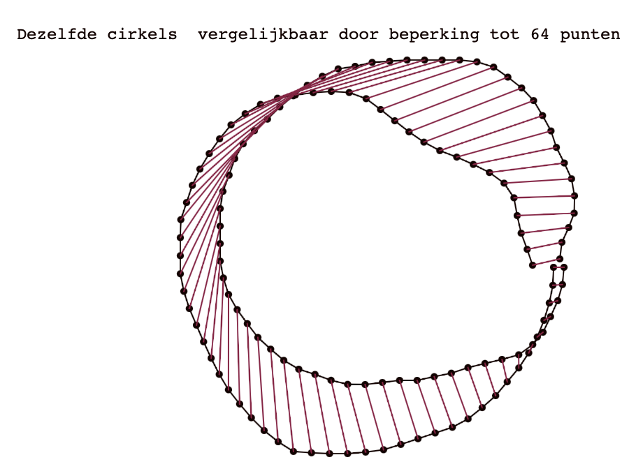
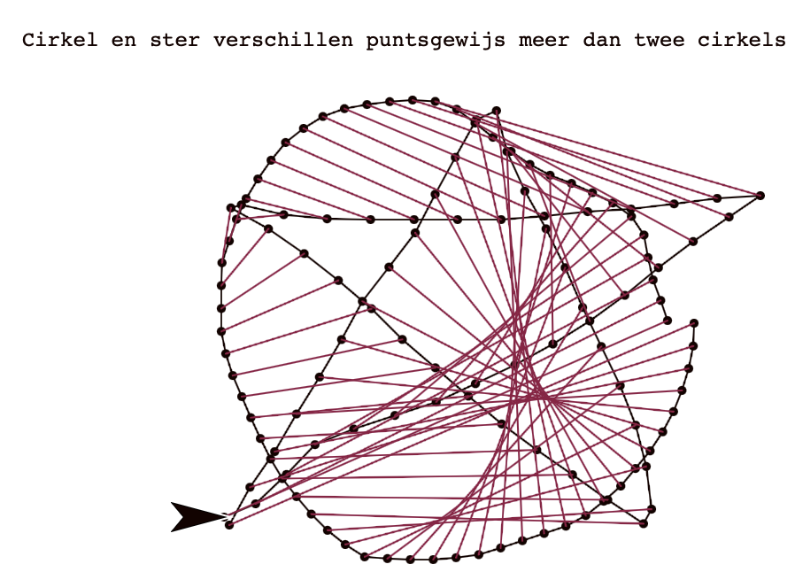
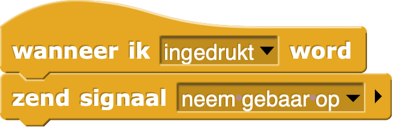
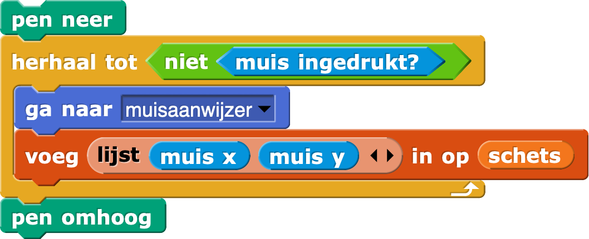
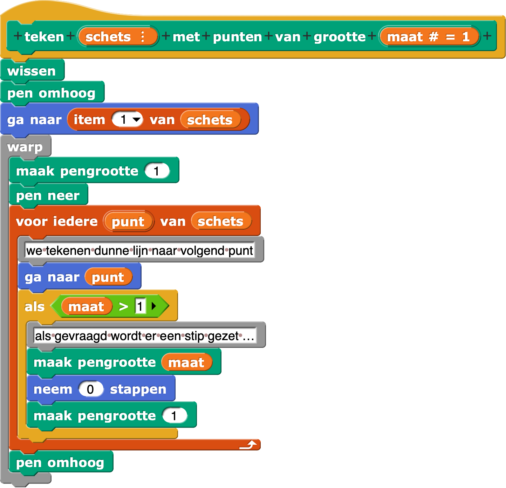
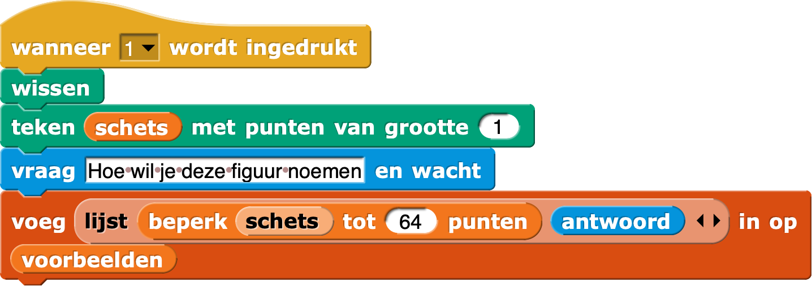
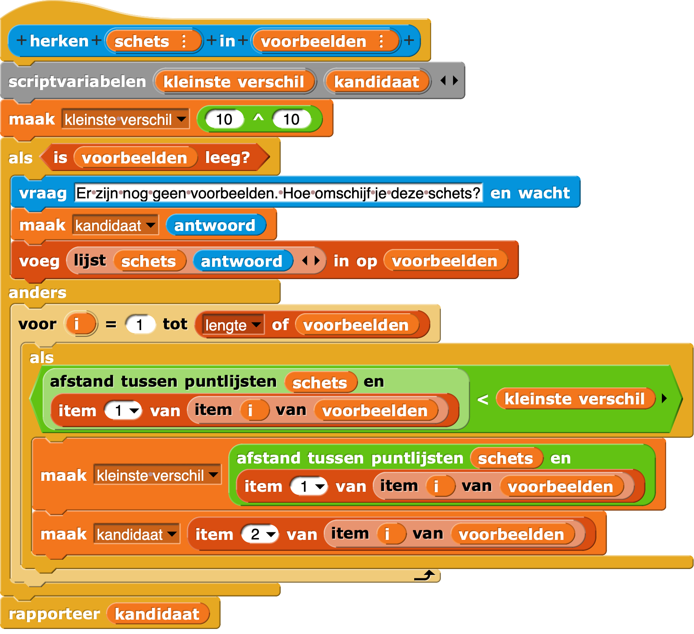

#Grand gesture

##Hoe je de computer je gebaren en tekeningen laat herkennen

Deze les is gebaseerd om een lezing van Jens Mönig, de ontwikkelaar van Snap, waarvan de 40 minuten video uitleg [hier](https://www.youtube.com/watch?v=xk4wo7Yql-U) te bekijken is.

##Leerdoelen
Het zelf helemaal uitprogrammeren van een praktisch probleem is een goede oefening vaardiger te worden in programmeren. Omdat programmeren *het* gereedschap is om computers nuttig voor ons te maken is dat een doel.

Belangrijker is meer vertrouwd worden met een algemene aanpak die je niet alleen bij informatica kunt gebruiken. De wiskundige György Pólya schreef in 1945 een uiterst nuttig boekje [How to solve it](https://en.wikipedia.org/wiki/How_to_Solve_It) met het volgende algemene stappenplan

1. Zorg dat je het probleem dat je wilt oplossen *begrijpt*
2. Nadat je het begrijpt maak je een plan (rekening houdend met de gereedschappen die je beheerst)
3. Voer het plan uit
4. Kijk naar het resultaat. Kan het beter?

Iedereen die een exacte studie overweegt doet er goed aan de komende tien jaar dit boekje een paar keer te lezen!

Deze lesbrief kent analoog aan Pólya vier hoofdstukken: probleem afbakening, plan, uitvoering en opties voor verbetering.

##Probleem afbakening
Tijdens de les hebben we het gehad over gebaren met je vingers op een scherm van telefoon, bijvoorbeeld *swipe* en *pinch*. We hebben het ook gehad over het tekenen van vormen (cirkel, hartje, ster, …) en hoe de computer die zou herkennen.

Op dit moment beperken we ons tot het tweede onderdeel. We willen dat de computer in reactie op een tekenactie van ons kan vertellen wat we getekend hebt. Omdat de computer van zichzelf niets weet zullen we de computer eerst moeten *trainen*. We willen in de computer een lijst hebben van eerder gemaakte tekeningen met hun benaming. Dat stelt dus meteen vragen over hoe een tekening in de computer kan worden opgeslagen. En als we dan zo'n collectie bekende tekeningen hebben, hoe bepalen we welke het meest lijkt om onze nieuwe tekening.  

Hier gaan we gebruik maken van het idee dat een getekende vorm eigenlijk een lijst van punten is. Tijdens het tekenen gaan we een lijst bijhouden van de muisposities. Zo'n lijst kunnen we gebruiken om de vorm (opnieuw) te tekenen, maar we kunnen nu ook twee vormen vergelijken door de twee lijsten te vergelijken. Wanneer vinden we dat twee lijsten (ongeveer) dezelfde vorm representeren? We kunnen punt-voor-punt de afstand meten, bij elkaar optellen en als die som niet al te groot is besluiten dat de lijsten dezelfde vorm weergeven. Dit vraagt niet alleen om een functie die de afstand tussen twee punten berekent, maar ook (en dat is ingewikkelder) om lijsten die goed te vergelijken zijn, bijvoorbeeld doordat ze hetzelfde aantal punten hebben.

##Plan

- Een muisklik ergens op het canvas start de *opname* van een nieuwe schets.
- Het opnemen van een schets is het verzamelen van de muisposities in een lijst
- We willen de schets zichtbaar maken als tekening, en als tekening met voor iedere muispositie een wat dikkere stip
- We willen schetsen standardiseren to een vast aantal punten, bijvoorbeeld 64, die netjes verdeeld zijn tussen begin en eind
- We willen schetsen met hun naam (hart, ster, …) kunnen opnemen in een lijst van voorbeelden
- We willen het verschil tussen twee schetsen kunnen uitrekenen door puntsgewijs de afstanden op te tellen
- We willen bij een nieuwe schets in de lijst van voorbeelden een best passende kunnen selecteren.
- … 

We werken met [Snap!](https://snap.berkeley.edu/run) omdat we geleerd hebben hoe we in dat programma met lijsten kunnen omgaan en hoe we met de *pen*-blokken kunnen tekenen.

##Bouwen

###Muis indrukken om te starten

Zodra er ergens op het canvas de muis wordt ingedrukt, willen we dat ons programma start. We kunnen dit eenvoudig bereiken door het **speelveld** te prograameren om een signaal te sturen als de muis wordt ingedrukt. De **sprite**, die we sensor zouden kunnen noemen, moet dan in actie komen als dat signaal binnenkomt.

###Een lijst maken om muisposities te onthouden
We hebben een variabele **schets** nodig die we aan het begin *initialiseren* als lege lijst. 

###Hoe gaan we muisposities vastleggen, en hoe lang gaan we daarmee door?

Het loslaten van de muisknop markeert het einde van onze tekening, dus zijn we blij dat Snap! een *herhaal tot*-blok kent. Wat moeten we herhalen? Muisposities vastleggen! En als we toch bezig zijn kunnen we de tekening ook in beeld brengen.

Merk op dat je in plaats van  ook  kunt gebruiken. Dat laatste blok is nieuw en nog niet naar het Nederlands vertaald, en rapporteert een lijstje met x- en y-waarde van de muis.

###De muisposties zichtbaar maken
Om in de tekening, die na bovenstaande is vastgelegd in variabele **schets**, de muisposties zichtbaar te maken, maken we een tekenopdracht:

###De schets *re samplen* naar een vast aantal punten.

Het blijkt nog best lastig te zijn om helder uit te leggen hoe je een schets met, zeg, 150 punten *resampled* naar 64 punten. Het idee is in grote lijnen om eerste de lengte van de schets te bepalen, door de lengtes van alle segmenten bij elkaar op te tellen. Vervolgens deel je die lengte door het gewenste aantal punten min één, om de afstand te bepalen tussen de punten in de nieuwe lijst. Daarna loop je de oude schets af, waarbij je na iedere *segment lengte* een nieuw punt aan de lijst toevoegt.

Heronder zie je de complete code. Je kan die ook [downloaden](https://github.com/xota/grandGesture/images/beperkSchetsTotAantalPunten.xml) en vervolgens in je eigen project importeren met import of door slepen vanuit downloadmap naar Snap!-project. Wie tijd over heeft bouwt het zelf met deze afbeelding als leidraad.

###Schets toevoegen aan voorbeelden

Zeker in het begin, maar wie weet ook later als je nieuwe vormen wil toevoegen, wil je de computer leren wat de schets voorstelt. Voor bedieningsgemak maak ik dat vast aan de toets **1**.
Eenmalig heb ik een variabele **voorbeelden** aangemaakt en *geïnitialiseerd* als lege lijst: 

###Een schets herkennen binnen een voorbeelden lijst

Om verder te kunnen werken met het resultaat is er een functie met als invoer een gestandaardiseerde schets en lijst van voorbeelden. De uitvoer is de *naam* van het voorbeeld dat het *beste past*.

##Opties voor verbetering

Vormen worden beter vergelijkbaar als we ze een zelfde grootte geven en zorgen dat ze allemaal hetzelfde middelpunt hebben.

###Middelpunt standaardiseren
 
Om ervoor te zorgen dat elke vorm beoordeeld wordt alsof die mooi rondom $(0, 0)$ is getekend kunnen we alle punten van de schets verschuiven. Om rond de oorsprong uit te komen moeten we de x-waarden verminderen met het gemiddelde van alle x-waarden, en de y-waarden met de gemiddelde y-waarde, dat wil zeggen een verschijven van $(-\overline{x}, -\overline{y})$.

###Grootte standaardiseren

De breedte van de vorm is het verschil tussen de maximale x-waarde en minimale x-waarde. Wil je dat standaardisern tot bijvoorbeeld 200 pixels, dan moeten alle punten uit de schets vermenigvuldigd worden met een factor $\frac{200}{breedte}$

###Linkshandigheid?

Een vorm ziet er hetzelfde uit wanneer je schets van punt 1 tot laatst tekent, of in omgekeerde richting. Sommige figuren worden door verschillende mensen in verschillende richting getekend. Die vromen zien er dan hetzelfde uit maart hebben relatief grote onderlinge afstand omdat eigenlijk de verkeerde punten met elkaar vergeleken worden. Een begin van een oplossing checkt een neiuwe vorm niet alleen tegen alle reeds bekende voorbeelden, maar ook hun omkering:

###Met lijsten kan je optellen en vermenigvuldigen

*Snap!* is uitermate handig voor het manipuleren van lijsten, als je bijvoorbeeld een *getal* optelt bij een lijst getallen, krijg je een lijst waarbij bij alle elementen dat getal is opgeteld. Dat werkt ook met paren getallen. En het werkt ook met vermenigvuldigen!
Probeer eens de volgende tekeninstructies uit:

